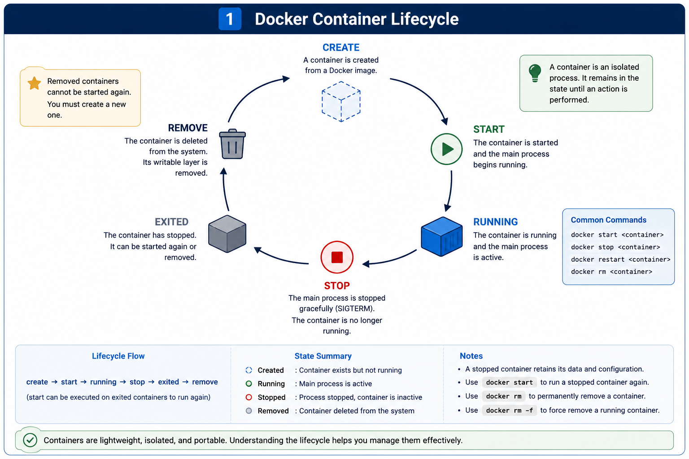

# Docker Container Lifecycle

## Objective

Learn how Docker containers progress through their lifecycle, manage running and stopped containers, inspect container details, retrieve logs, and perform common container management operations.


## Diagram




## What is a Container Lifecycle?

The container lifecycle refers to the sequence of states that a Docker container goes through from creation until deletion.

1. Created
An initial state after a container has been defined and configured using a container image, but before execution begins. At this stage, the file system and network configurations are prepared, but no computing resources (like CPU or memory) are actively being used.

2. Running
When you start the container, it enters the running state. This sets up Linux namespace and allocates system resource, and executes the primary application process defined in the image's ENTRYPOINT or CMD.

3. Paused
A running container can be explicitly paused. This temporarily suspends all processes inside the container without terminating them or destroying the container's environment. The container can then be "unpaused" to resume where it left off.

4. Stopped (Exited)
A container stops when its primary application process finishes its task, crashes, or receives a kill/stop signal. When stopped, all running processes halt and memory is freed, but the container instance and its configuration remain in the system. Stopped containers can be restarted at a later time.

5. Dead or Terminated
If a container cannot start properly due to system conflicts or resource leaks, it transitions to a dead state. Dead containers cannot be restarted and must be deleted. When a container is no longer needed, it is deleted and cleaned up, permanently freeing all its associated resources.


## Common Docker Commands

### docker run

Creates and starts a new container from a specified image in a single command. It downloads the image automatically if it is not found locally.

Example:

```bash
docker run company-web-app
```

**When to use:**
- Launch a new container containerized environment from scratch for the first time


### docker run --name

Assigns a custom, human-readable name to a new container instead of letting Docker generate a random phrase. This makes the container much easier to reference in future commands.

Example:

```bash
docker run --name company-app company-web-app
```

**When to use:**
- Identify and manage specific containers easily without memorizing long, random ID strings


### docker run -d

Starts a new container in a "detached" mode, which runs the process silently in the background. This frees up your current terminal window for other tasks.

Example:

```bash
docker run -d --name company-nginx nginx
```

**When to use:**
- Start long-running background services like web servers, databases, or message queues


### docker ps

Lists all currently active and running containers on your system along with their basic metadata. It provides an immediate snapshot of your live environment.

Example:

```bash
docker ps
```

**When to use:**
- Check which applications are healthy, verify active ports, or find a container's runtime ID


### docker ps -a

Displays a comprehensive list of all containers on your system, regardless of whether they are running, stopped, or exited. It uncovers hidden, inactive resource consumers.

Example:

```bash
docker ps -a
```

**When to use:**
- Troubleshoot failed containers, locate stopped environments, or review historical container instances


### docker logs

Retrieves the standard output and standard error streams directly from a specific container. It provides visibility into what is happening inside the container.

Example:

```bash
docker logs company-app
```

**When to use:**
- Debug application errors, inspect application print statements, or verify successful startup routines


### docker inspect

Returns low-level, highly detailed configuration and state information for a container in a structured JSON format. It exposes deep network, volume, and environment details.

Example:

```bash
docker inspect company-app
```

**When to use:**
- Extract specific technical details like internal IP addresses, environment variables, or volume mount paths


### docker start

Wakes up and resumes execution of one or more stopped containers without changing their existing configurations or file systems. It acts on existing container instances.

Example:

```bash
docker start company-app
```

**When to use:**
- Reactivate a container that was previously halted without creating a duplicate instance


### docker stop

Gracefully shuts down a running container by issuing a standard termination signal (SIGTERM), followed by a forced kill signal (SIGKILL) if it fails to stop.

Example:

```bash
docker stop company-app
```

**When to use:**
- Safely pause application services or prepare a container environment for maintenance


### docker restart

Combines the stop and start operations into a single command to power-cycle a container. It forces the primary application process to reload entirely.

Example:

```bash
docker restart company-app
```

**When to use:**
- Apply quick configuration updates, clear memory leaks, or recover from application crashes.


### docker rm

Permanently deletes one or more stopped containers from the host machine's disk storage. This clears up system space and organizational clutter.

Example:

```bash
docker rm company-app
```

**When to use:**
- Clean up old, exited container instances that are no longer needed for development


### docker rm -f

Forces the immediate deletion of a container, even if it is currently active and running, by using a harsh kill signal (SIGKILL).

Example:

```bash
docker rm -f company-app
```

**When to use:**
- Clear stuck or frozen containers instantly without waiting for a standard graceful shutdown.


## Practical Scenario

During the lab, I built the `company-web-app` Docker image and created containers from it. Since the Python application only prints a message and exits, the container immediately moved to the `Exited (0)` state after completing its task.

I also ran an `nginx` container in detached mode using `docker run -d --name company-nginx nginx`. Unlike the Python script container, the Nginx container continued running in the background because its main web server process stayed active.

When I tried to remove the running Nginx container with `docker rm company-nginx`, Docker rejected the command because the container was still running. I then used `docker rm -f company-nginx` to forcefully remove it.


## Interview Questions

### 1. Why does a container stop after its main process exits?

A container is designed to isolate and run exactly one primary application or service, which is managed by Process ID 1 (PID 1). Unlike a virtual machine that boots an entire operating system, a container only stays active as long as this specific parent process is alive. Once the primary process completes its task, hits an error, or shuts down, the container automatically transitions to the stopped state.


### 2. What is the difference between `docker ps` and `docker ps -a`?

`docker ps` acts as a real-time monitor, filtering and showing only the containers that are currently running on your system.

`docker ps -a` bypasses this filter and returns a complete inventory of every container on the host machine, including those that have crashed, exited, or been stopped.


### 3. Why use `--name` when running a container?

Using `--name` flag lets you overwrite randomized hex ID and a random phrase with a clear, predictable, human-readable string instead. This lets you reference the container instantly in script automations or standard daily maintenance commands without constantly checking the container list to find its generated ID.


### 4. Why did `docker rm company-nginx` fail?

`docker rm` command is strictly restricted from removing active, running containers to prevent accidental data loss and sudden application downtime. If the `company-nginx` container was actively serving traffic when the command was run, Docker rejected the request with an error. To successfully delete it, you must either halt it first using `docker stop` or bypass the protection layer entirely using the force deletion flag `docker rm -f`.


### 5. What is detached mode?

Detached mode is triggered by adding the `-d` flag to your run command. It instructs Docker to fork the container execution process straight to the background of your host operating system. Instead of streaming active application logs directly onto your terminal window and blocking input, Docker prints a single unique container ID string and immediately hands control of the command line back to you.


## Common Mistakes

- Forgetting to provide an image name when using `docker run`.
- Expecting `docker ps` to show stopped containers.
- Trying to remove a running container without stopping it first.
- Confusing `docker start` with `docker run`.
- Forgetting that a container stops when its main process exits.


## Notes

This lab was completed using Docker Desktop with WSL integration on Ubuntu.

During the lab, I learned that short-lived containers exit immediately after their main process finishes, while long-running services like Nginx continue running in detached mode. I also learned that Docker prevents running containers from being removed unless they are stopped first or force removed.


## Commands Used

```bash
docker build -t company-web-app .
docker images
docker run company-web-app
docker run --name company-app company-web-app
docker ps
docker ps -a
docker logs company-app
docker inspect company-app
docker rm company-app
docker run -d --name company-nginx nginx
docker stop company-nginx
docker restart company-nginx
docker rm company-nginx
docker rm -f company-nginx
```